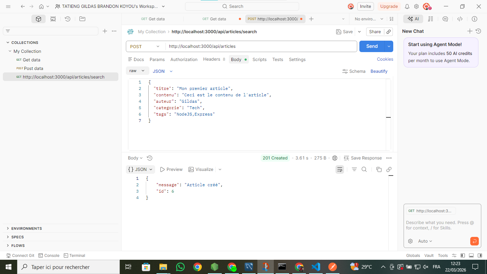
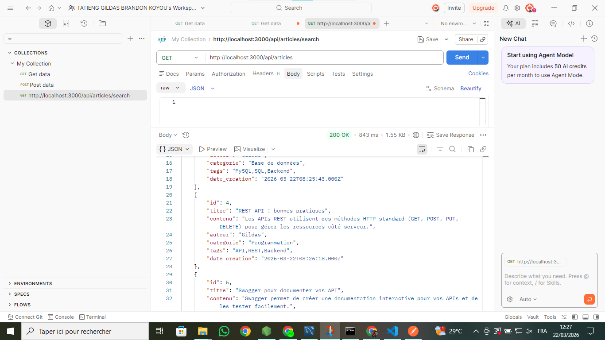
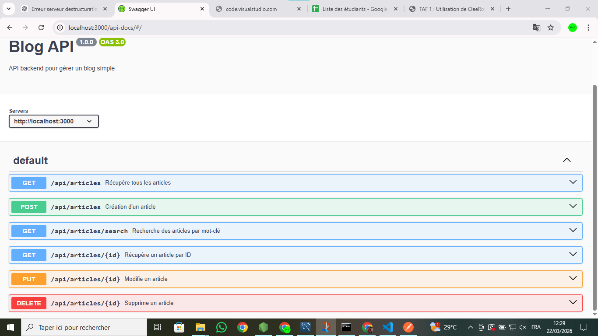

````markdown
# Blog API Backend

## Description
API backend pour gérer un blog simple avec **Node.js**, **Express** et **MySQL**.  
Permet de **créer, lire, modifier, supprimer et rechercher** des articles.  
La documentation des endpoints est disponible via **Swagger**.
Il sagit d'un travail académique pour le compte de l'unité d'enseignement **INF 222**

---

## Installation

1. Cloner le projet :
```bash
git clone https://github.com/KOYOU-TATIENG-GILDAS-BRANDON/blog-api.git
````

2. Installer les dépendances :

```bash
cd blog-api
npm install
```

3. Configurer la base de données MySQL :

* Créer une base de données `blog`
* Créer la table `articles` :

```sql
CREATE TABLE articles (
  id INT AUTO_INCREMENT PRIMARY KEY,
  titre VARCHAR(255) NOT NULL,
  contenu TEXT,
  auteur VARCHAR(100) NOT NULL,
  categorie VARCHAR(50),
  tags VARCHAR(100),
  date_creation DATETIME DEFAULT CURRENT_TIMESTAMP
);
```

4. Modifier `db.js` avec tes identifiants MySQL.

5. Lancer le serveur :

```bash
node server.js
```

---

## Endpoints

| Méthode | Endpoint                         | Description                        |
| ------- | -------------------------------- | ---------------------------------- |
| GET     | /api/articles                    | Récupère tous les articles         |
| GET     | /api/articles/{id}               | Récupère un article par ID         |
| GET     | /api/articles/search?query=texte | Recherche des articles par mot-clé |
| POST    | /api/articles                    | Crée un article                    |
| PUT     | /api/articles/{id}               | Modifie un article                 |
| DELETE  | /api/articles/{id}               | Supprime un article                |

---

## Swagger

* Swagger UI disponible sur : `http://localhost:3000/api-docs`
* Permet de tester tous les endpoints directement depuis l’interface.

---

## Exemples d’utilisation

### Créer un article

```bash
POST /api/articles
Content-Type: application/json

{
  "titre": "Mon premier article",
  "contenu": "Ceci est le contenu de l'article",
  "auteur": "Gildas",
  "categorie": "Tech",
  "tags": "NodeJS,Express"
}
```

Réponse :

```json
{
  "message": "Article créé",
  "id": 1
}
```

### Lire tous les articles

```bash
GET /api/articles
```

Réponse :

```json
[
  {
    "id": 1,
    "titre": "Mon premier article",
    "contenu": "Ceci est le contenu de l'article",
    "auteur": "Gildas",
    "categorie": "Tech",
    "tags": "NodeJS,Express",
    "date_creation": "2026-03-22T10:00:00.000Z"
  }
]
```

### Rechercher un article

```bash
GET /api/articles/search?query=NodeJS
```

Réponse :

```json
[
  {
    "id": 1,
    "titre": "Mon premier article",
    "contenu": "Ceci est le contenu de l'article",
    "auteur": "Gildas",
    "categorie": "Tech",
    "tags": "NodeJS,Express",
    "date_creation": "2026-03-22T10:00:00.000Z"
  }
]
```

### Modifier un article

```bash
PUT /api/articles/1
Content-Type: application/json

{
  "titre": "Article mis à jour",
  "contenu": "Nouveau contenu",
  "categorie": "Programmation",
  "tags": "NodeJS,Express,API"
}
```

Réponse :

```json
{
  "message": "Article modifié"
}
```

### Supprimer un article

```bash
DELETE /api/articles/1
```

Réponse :

```json
{
  "message": "Article supprimé"
}
```

---

## Bonnes pratiques

* Validation des champs obligatoires (titre et auteur).
* Codes HTTP corrects : 200 (OK), 201 (Créé), 400 (Bad Request), 404 (Not Found), 500 (Erreur serveur).
* Séparation claire entre **routes**, **contrôleurs** et **modèles**.
* Documentation Swagger pour tester facilement les endpoints.

---

## Captures d’écran (TAF)

* **Création d’un article** :
  

* **Lecture des articles** :
  

* **Swagger UI** :
  


---

## Lien GitHub

* Dépôt du projet : [https://github.com/KOYOU-TATIENG-GILDAS-BRANDON/blog-api](https://github.com/KOYOU-TATIENG-GILDAS-BRANDON/blog-api)

---

## Auteur

* Nom : **[KOYOU TATIENG]**
* Prénom : **[GILDAS BRANDON]**
* Matricule : **[23U2868]**
* Etudiant a l'université de Yaoundé I en deuxième année informatique

```

